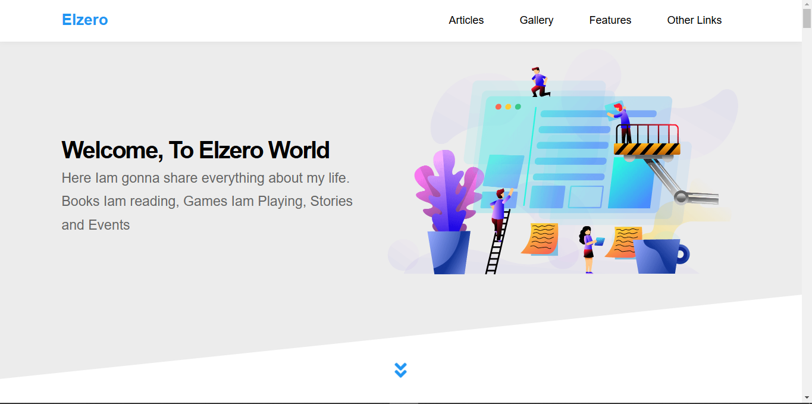
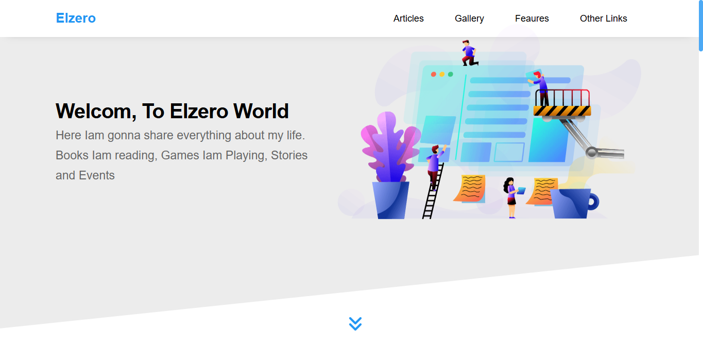

  
  <h1 align="center"><a href="https://MoAjabali.github.io/Elzero.elzero-template-three/"> Elzero | Elzero template three </a></h1>
  

     This is a solution fro <a href="https://elzero.org/practical-html-css/">Elzero HTML, CSS Templates practice</a>. From <a href="https://elzero.org/">Elzero web School</a>.
   

  

## Table of Contents

- [Overview](#overview)
  - [Quick Introduction](#quick-introduction)
  - [Challenge Requirements](#challenge-requirements)
  - [What I Implemented](#what-i-implemented-🤔)
  - [Screenshots](#screenshots-📸)
    - [Original website](#original-website)
    - [Mine](#mine-🌚)
  - [Links](#links)
- [My process](#my-process)
  - [Built with](#built-with)
- [Author](#author)
- [Special Thanks](#special-thanks)

## Overview

### Quick Introduction
This website is a solution for the third website of four website (template) that [Elzero](https://elzero.org/) give as assiments to test the students skills.
**Note:** This website for educational purpose.

### Challenge Requirements 🏳
> Simply programme the [website](https://elzerowebschool.github.io/HTML_And_CSS_Template_Three/) that have been given to you.

### What I Implemented 🤔
What about to give us [visit]() and know what I do, I was joking I implemented all the website.

### Screenshot 📸
#### Original website

#### Mine 🌚

They are like brother, aren't they 🤔.

### Links
Original website: [https://elzerowebschool.github.io/HTML_And_CSS_Template_Three/](https://elzerowebschool.github.io/HTML_And_CSS_Template_Three/)
Mine: [https://MoAjabali.github.io/Elzero.elzero-template-three/](https://MoAjabali.github.io/Elzero.elzero-template-three/)

## My process
### Built with
- HTML5 & CSS3
- Flex box
- Grid
- animation
- JS
- animated counter
- Responsive website from the smallest screen to the biggest

## Author
- [@mohammed-Aljablai](https://github.com/MoAjabali)

## Special Thanks
After Thanks Allah and the person who support me, I would like to thanks the one who educated me and million of people like me Eng.[Osama Mohammed](https://github.com/OsamaElzero).

# Stars ✨ will help me.